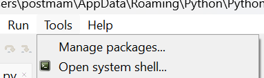
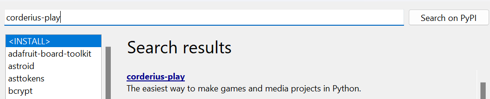

## Installeer coderius-play
Om de code uit dit project gebruiken moeten we nog iets extra's op onze computer installeren. Dit heet een package.

Mocht je bekend zijn met **pip**, dan kun je het package installeren via:
```bash
pip install coderius-play
```

Anders kunnen we het uiteraard via Thonny installeren:
Klik op "Tools" en daarna "Manage packages"



Zoek vervolgens naar "coderius-play" en installeer het



