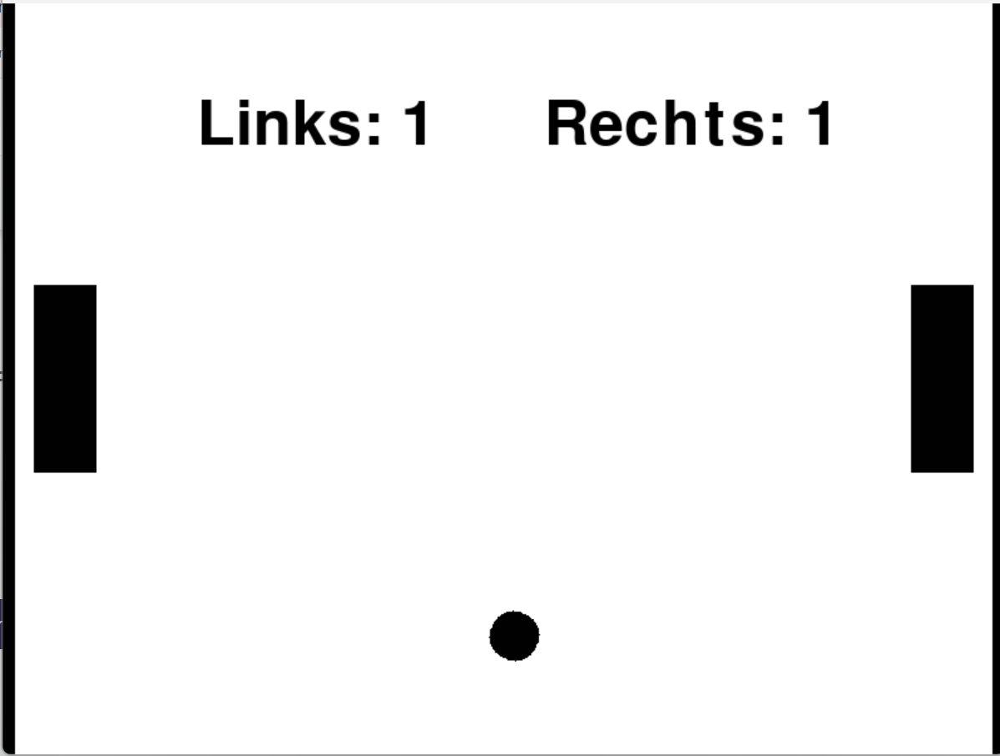

# 7.1 Pong
Waarom niet? Een super bekend spel en deze library is uitermate geschikt voor het bouwen van pong.
Laten we eens bekijken wat we nodig hebben? Bij elke stap geven we tips hoe je het kan aanpakken. 

Voor voorbeelden ga je uiteraard naar de [Cheatsheet](../cheatsheet.md).

## De bal
Voor de bal gebruik je een cirkel die je gaat laten bewegen.
Een tip is om **start_physics(obeys_gravity=False, x_speed=200, friction=0)** te gebruiken als start.

## De batjes
Voor het batje gebruik je een rechthoek.
Ook hier voeg je fysica aan toe met **start_physics(obeys_gravity=False, can_move=False. friction=0)**.
Je maakt er twee, anders kunnen we niet tegen elkaar spelen.

## Batje bewegen
**@play.when_key_pressed** kun je gebruiken zodat je de batjes naar boven en beneden kan bewegen.

## Wanneer krijgt iemand een punt?
We gaan nog twee dunne balken maken, precies aan de linkerkant van het scherm en precies aan de rechterkant van het scherm. Iemand krijgt dan een punt als de bal de muur heeft geraakt. Dit moet maar eenmalig gebeuren. Tip: bekijk [5. Gebeurtenissen bij een vorm](../vorm_gebeurtenissen.md) hoe je dit moet doen. 

## Score & Reset
Voor de score gebruik je een tekst, één voor de score van de linkerspeler en één voor de rechter.
Vergeet niet **global** te gebruiken in je functie als je de score gaat aanpassen.
ls de bal voorbij de linker- ofrechterrand? 
- Punt voor tegenpartij
- bal naar midden
- beginsnelheid zetten
- score-tekst bijwerken. 

## Bal ook omhoog
Naast x_speed bestaat er ook y_speed. Dus **start_physics(obeys_gravity=False, x_speed=60, y_speed=60)**.

Hieronder een voorbeeld:

## Mogelijke uitbreidingen
- Wanneer heeft iemand gewonnen?
- Kun je het batje de computer laten zijn?
- Hoe maak je een startmenu?
- Power-ups: Grotere paddle, langzamere tegenstander, multi-ball, “ghost” bal. 
- Status bar met punten per speler 
- Versnellen: per gemaakte punt de balsnelheid verhogen. 
- Timer met speltijd totdat is afgelopen 

