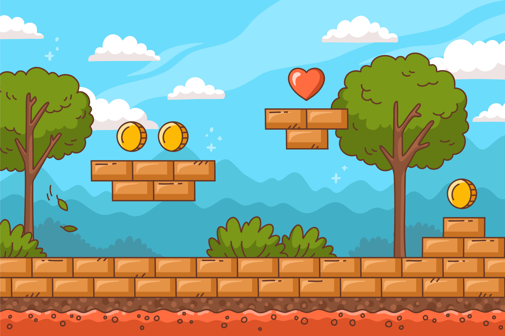

# 1.5 Je eerste afbeelding
We kunnen ook een afbeelding laten zien. Hiervoor gebruiken we **play.new_image**.
We hebben alleen één probleem: we hebben een afbeelding nodig.

## Opdracht 1.5.a je afbeelding op het scherm tonen via play

a) Download de onderstaande afbeelding naar je computer. Klik er met je rechtermuisknop op en kies voor "Opslaan als". Sla het bestand op in **dezelfde** map als waar jij je Python bestand hebt opgeslagen.



b) kopieer het onderstaande codefragment naar je editor en voer het uit

```python
import play 

play.new_image("platform.jpg")

play.start_program()
```

Als het goed is, zou je de afbeelding op je scherm moeten zien.

c) de afbeelding is een beetje groot. Kun je in de [cheatsheet](cheatsheet.md) ontdekken hoe we de afbeelding kleiner kunnen maken?

<details>
    <summary>Klik hier voor een tip</summary>
Wat welk gebruik je in het Engels voor grootte?
</details>

<details>
    <summary>Klik hier voor het antwoord</summary>

```python
import play

play.new_image("platform.jpg", size=20)

play.start_program()
```

</details>

## 1.5.1 Wat kan ik allemaal aanpassen?

Je **moet** voor **play.new_image** kiezen uit:
- **image**: dit is de naam van het bestand op jouw computer, bijvoorbeeld **cat.jpg** (als je je afbeelding zo genoemd hebt)

Je **kunt** voor **play.new_image** kiezen uit:
- **x**: x-positie, staat standaard op 0 (het midden). Kleiner dan 0 is naar links, groter dan 0 is naar rechts.
- **y**: y-positie, staat standaard op 0 (het midden). Kleiner dan 0 is naar beneden, groter dan 0 is naar boven.
- **size**: de grootte van de afbeelding. De grootte staat standaard op 100. Een hoger getal dan 100 maakt de afbeelding groter en een lager getal maakt de afbeelding kleiner.
**angle**: de hoek. Je kunt je afbeelding draaien door de **angle** te veranderen. Als je **angle** naar 180 verandert, staat de afbeelding op z'n kop.
- **transparency**: doorzichtigheid, 0 is onzichtbaar. 100 is volledig zichtbaar.


